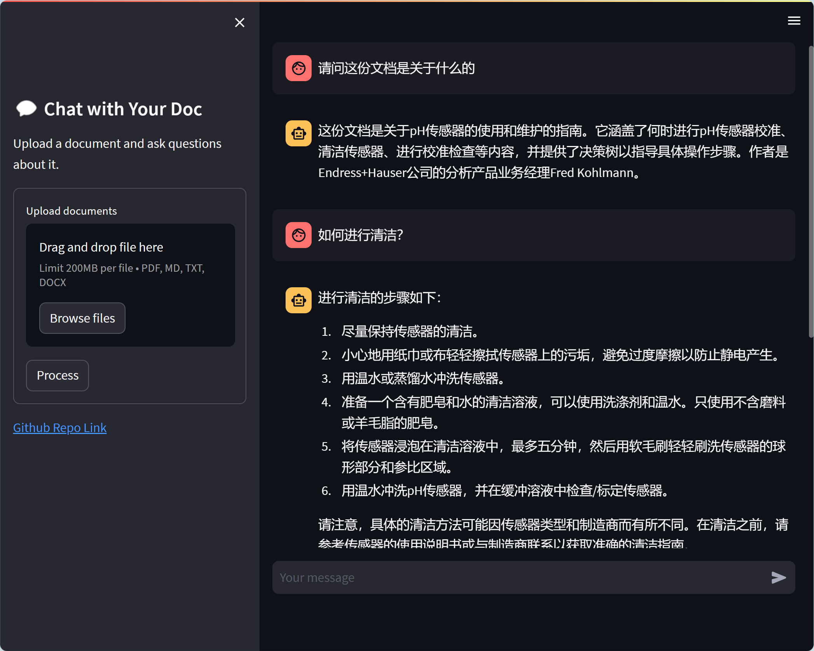
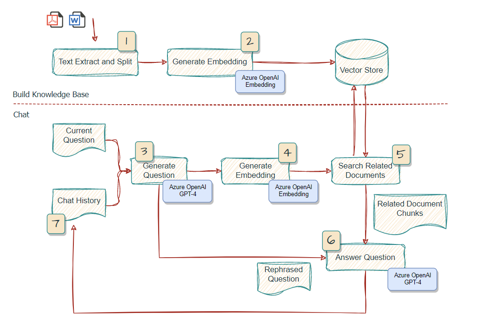
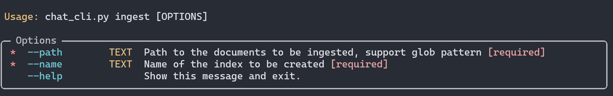
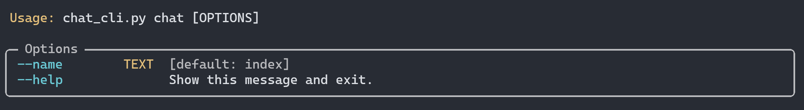

# chat-with-your-doc

`chat-with-your-doc` is a demonstration application that leverages the capabilities of Azure OpenAI GPT-4 and LangChain to enable users to chat with their documents. This repository hosts the codebase, instructions, and resources needed to set up and run the application.

## Introduction

The primary goal of this project is to simplify the interaction with documents and extract valuable information with using natural language. This project is built using LangChain and Azure OpenAI GPT-4/ChatGPT to deliver a smooth and natural conversational experience to the user.



## Features

- Upload documents as external knowledge base for Azure OpenAI GPT-4/ChatGPT.
- Support various format including PDF, DOCX, PPTX, TXT and etc.
- Chat with the document content, ask questions, and get relevant answers based on the context.
- User-friendly interface to ensure seamless interaction.

### Todo
- [ ] Show source documents for answers in the web gui
- [ ] Support streaming of answers
- [ ] Support swith of chain type and streaming LangChain output in the web gui

## Architecture



## Installation

To get started with `Chat-with-your-doc`, follow these steps:

1. Clone the repository:

```bash
git clone https://github.com/linjungz/chat-with-your-doc.git
```

2. Change into the `chat-with-your-doc` directory:

```bash
cd chat-with-your-doc
```

3. Install the required Python packages:

Create virtual environment:

```bash
python3 -m venv .venv
source .venv/bin/activate
```

Install depenancies:

```bash
pip install -r requirements.txt
```

## Configuration

1. Obtain your Azure OpenAI API key, Endpoint and Deployment Name from the [Azure Portal](https://portal.azure.com/).

2. Set the environment variable in `.env` file:

```
OPENAI_API_BASE=https://your-endpoint.openai.azure.com
OPENAI_API_KEY=your-key-here
OPENAI_DEPLOYMENT_NAME=your-deployment-name-here
```

## Usage: CLI

The CLI application is built to support both `ingest` and `chat` commands. Python library `typer` is used to build the command line interface.

### **Ingest**

This command would take the documents as input, split the texts, generate the embeddings and store in a vector store `FAISS`. The vector store would be store locally for later used for chat.



For example if you want to put all the PDFs in the directory into one single vector store named `surface`, you could run:
    
```bash
$ python chat_cli.py ingest --path "./data/source_documents/*.pdf" --name surface
```
Note that the path should be enclosed with double quotes to avoid shell expansion.

### **Chat**

This command would start a interactive chat, with documents as a external knowledge base in a vector store. You could choose which knowledge base to load for chat. 



Two sample documents about Surface has been provided in the [data/source_document](data/source_documents) directory and already ingested into the default vector store `index`, stored in the [data/vector_store](data/vector_store). You could run the following command to start a chat with the documents:

```bash
$ python chat_cli.py chat
```

Or you could specify the vector store to load for chat:

```bash
$ python chat_cli.py chat --name surface
```

## Usage: Web

This will initialize the application and open up the user interface in your default web browser. You can now upload a document to create a knowledge base and start a conversation with it.

`Gradio` is used for quickly building the Web GUI and `Hupper` is used to ease the development.

For development purpuse, you may run `python watcher.py` to start the web gui. Or you may directly run `python chat_web.py` without monitoring the change of the source files.

## Reference

`Langchain` is leveraged to quickly build a workflow interacting with Azure GPT-4. `ConversationalRetrievalChain` is used in this particular use case to support chat history. You may refer to this [link](https://python.langchain.com/en/latest/modules/chains/index_examples/chat_vector_db.html) for more detail.

For `chaintype`, by default `stuff` is used. For more detail, please refer to this [link](https://docs.langchain.com/docs/components/chains/index_related_chains)

## Credits

- The LangChain usage is inspired by [gpt4-pdf-chatbot-langchain](https://github.com/mayooear/gpt4-pdf-chatbot-langchain)
- The Web GUI is inspired by [langchain-ChatGLM](https://github.com/imClumsyPanda/langchain-ChatGLM)
- The processing of documents is inspired by [OpenAIEnterpriseChatBotAndQA](https://github.com/RicZhou-MS/OpenAIEnterpriseChatBotAndQA)

## License

`chat-with-your-doc` is released under the [MIT License](LICENSE). See the `LICENSE` file for more details.
